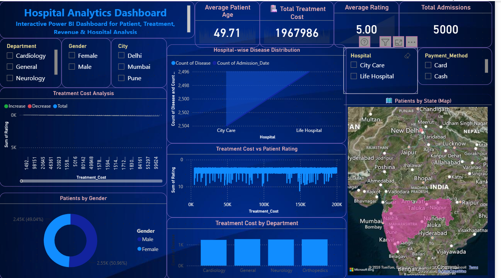

# 🏥 Hospital Analytics Dashboard | Power BI

## 📌 Project Overview

The **Hospital Analytics Dashboard** is an interactive Business Intelligence solution developed using **Microsoft Power BI**. It provides comprehensive insights into hospital operations, patient demographics, treatment costs, disease distribution, admissions, and payment methods. The dashboard enables users to explore healthcare data through dynamic visualizations, KPI cards, slicers, and an interactive state-wise map.

# 📑 Table of Contents

- [ Project Overview](#-project-overview)
- [ Business Problem](#-business-problem)
- [ Project Objectives](#-project-objectives)
- [ Key Performance Indicators (KPIs)](#-key-performance-indicators-kpis)
- [ Dashboard Features](#-dashboard-features)
- [ Tools & Technologies](#️-tools--technologies)
- [ Dataset Information](#-dataset-information)
- [ Dashboard Insights](#-dashboard-insights)
- [ Dashboard Preview](#-dashboard-preview)
- [ Skills Demonstrated](#-skills-demonstrated)
- [ Future Improvements](#-future-improvements)
- [ About the Author](#-about-the-author)
- [ Connect With Me](#-connect-with-me)

## 🎯 Business Problem

Hospitals generate large volumes of patient and operational data every day. Without proper analysis, it becomes difficult to monitor hospital performance, identify patient trends, and make informed decisions. This dashboard transforms raw healthcare data into meaningful insights that support data-driven decision-making.

## 🎯 Project Objectives

- Analyze patient demographics
- Monitor treatment costs
- Compare hospital performance
- Track admissions
- Analyze disease distribution
- Understand payment method usage
- Build an interactive healthcare dashboard

## 📊 Key Performance Indicators (KPIs)

- 👤 Total Patients
- 💰 Total Treatment Cost
- ⭐ Average Patient Rating
- 📅 Total Admissions
- 🏥 Total Hospitals
- 👨‍⚕️ Average Patient Age

## 📈 Dashboard Features

- Interactive KPI Cards
- Dynamic Slicers
- State-wise Patient Distribution Map
- Treatment Cost Analysis
- Department-wise Treatment Cost
- Hospital-wise Disease Distribution
- Patient Gender Distribution
- Payment Method Analysis
- Interactive Cross Filtering

## 🛠️ Tools & Technologies

- Microsoft Excel
- Microsoft Power BI
- Power Query
- DAX
- Data Modeling
- Data Visualization

## 📂 Dataset Information

The dataset contains the following fields:

- Patient ID
- Patient Name
- Age
- Gender
- Blood Group
- Disease
- Department
- Hospital
- Admission Date
- Discharge Date
- Bed Type
- Payment Method
- Insurance
- State
- Rating
- Treatment Cost

## 📈 Dashboard Insights

- Analyze treatment costs across departments.
- Compare patient distribution by gender.
- Monitor hospital-wise disease distribution.
- Explore patient locations using an interactive map.
- Filter dashboard data dynamically using slicers.
- Track key hospital performance metrics.

## 📷 Dashboard Preview

## 💡 Skills Demonstrated

- Microsoft Power BI
- Microsoft Excel
- Data Cleaning
- Data Modeling
- DAX
- Power Query
- Business Intelligence
- Data Visualization
- Healthcare Analytics

## 🚀 Future Improvements

- Add monthly admission trends.
- Build predictive analytics using Power BI Forecasting.
- Add doctor performance analysis.
- Include revenue forecasting.
- Connect with cloud-based data sources.

## 👤 About the Author

**Santoshi Pandalwad**

🎓 Aspiring Data Analyst

**Skills:** Microsoft Excel | Power BI | Data Visualization | Business Intelligence

## 🌐 Connect With Me

### 💼 LinkedIn

### 💻 GitHub

### 📧 Gmail

---

## ⭐ Support

If you found this project helpful, please consider giving this repository a ⭐.

Your support motivates me to build more Data Analytics and Business Intelligence projects.

Thank you for visiting my GitHub repository! 😊
